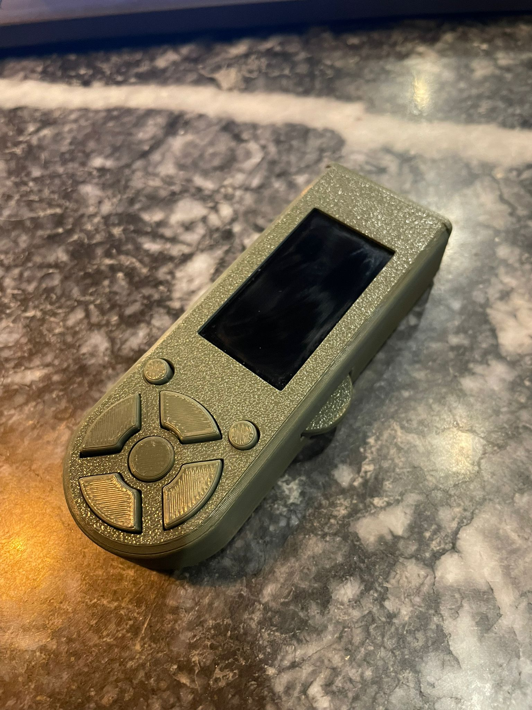
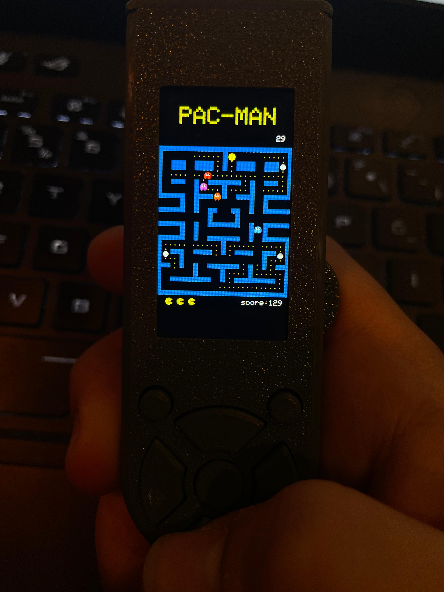
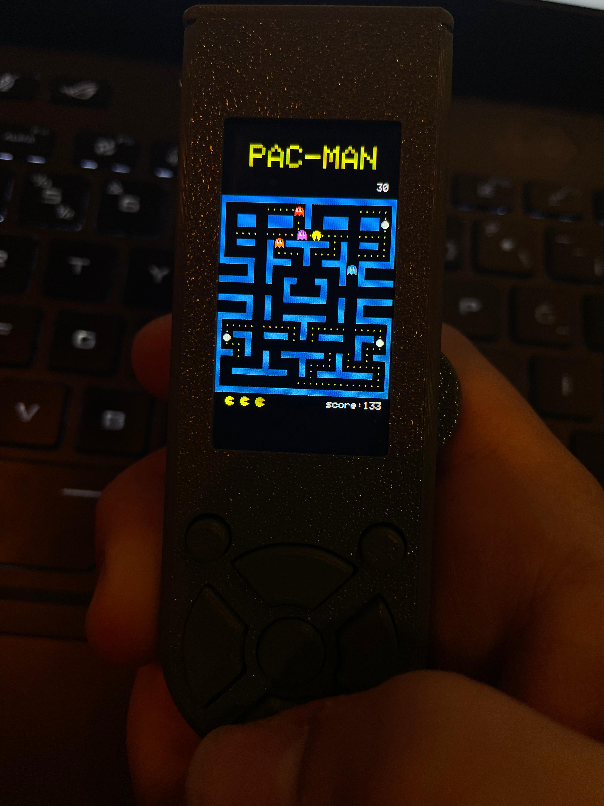

https://github.com/furkanYldr/EspCon/blob/main/images/pacman.gif# Standalone Handheld Game Console (ESP32)

## About the Project

This project aims to bring a portable gaming experience powered by the **ESP32** microcontroller. The console is built using custom hardware and software solutions designed to run retro-style games. The project merges modern technology with nostalgic gaming, creating a low-cost, compact, and portable gaming device.

## Features

An open-source platform for casual and retro games powered by the ESP32-S3. The project’s goal is to create a device that offers a fast, short, and enjoyable gaming experience, perfect for one-handed use. Ideal for playing during commutes, while waiting in line, or sipping coffee. The device includes a 1.9-inch screen, 4-directional buttons, 3 function buttons, and a scroll that acts as a trigger when held sideways, allowing easy navigation between menus and enhancing the gaming experience (for example, in the ColorCode game).

This platform focuses on re-creations of retro games, made without any game engine—just C++ and an additional graphics library. In the future, I plan to create a game engine where scene management can be done with simple code, using the mechanics collected from these games. If you're interested in contributing or collaborating, feel free to reach out!
### Device

## Setup

### Required Software

- **Arduino IDE**: I recommend using the Arduino IDE to program the ESP32.
- **ESP32 Board Support**: Follow the [ESP32 Arduino Setup Guide](https://github.com/espressif/arduino-esp32) to add ESP32 board support to the Arduino IDE.

### Connection and Upload

I will share the circuit diagram after creating an optimal solution. Currently, I am using the LilyGO T-Display S3 in the device. I am testing different setups by combining separate boards, screens, and chips. Once I resolve the issues, I will share the final version along with a suitable shell as an STL file for 3dprint .
For now, you need to check the pin connections in the game code for each game individually to test them. Stay tuned! 🚀

## Usage

The console features a simple menu with several retro games. Use the buttons to select and play the games. The console will provide basic instructions at the start of each game.

### Games
## Game List

| **Game Name**   | **Status**              | **Description**                          |
|-----------------|-------------------------|------------------------------------------|
| Flappy Ball     | Completed               | Simple Flappy Bird clone.               |
| Pac-Man         | In Progress (80%)       | Classic maze game, reverse engineered.  |
| ColorCode       | In Progress (60%)       | Minecraft color match game port (2D).   |
| 8pool           | Collision Complete      | 8-ball billiards simulation.            |
| FruitMerge      | Needs Huge Optimization | Merge fruits to score points.           |
| Space Invaders  | In Progress             | A retro space shooter, under development.|
| Breakout        | Planned                 | Brick-breaking game, will be added later. |
| Tetris          | Planned                 | Classic puzzle game, to be added soon.  |
| Snake           | Planned                 | The timeless snake game.                |
### Pacman 

### ColorCode 

### FlappyBall

### 8pool (in progress)

## Contributing

If you would like to contribute to this project, follow these steps:

1. **Fork** the project.
2. Create a new **branch**.
3. Make your changes and **commit** them.
4. **Submit a pull request**.

## Contact

For any questions or feedback regarding the project, feel free to [contact me](mailto:furkanYildirir00@gmail.com).
 add some physics element to esp32-s3
