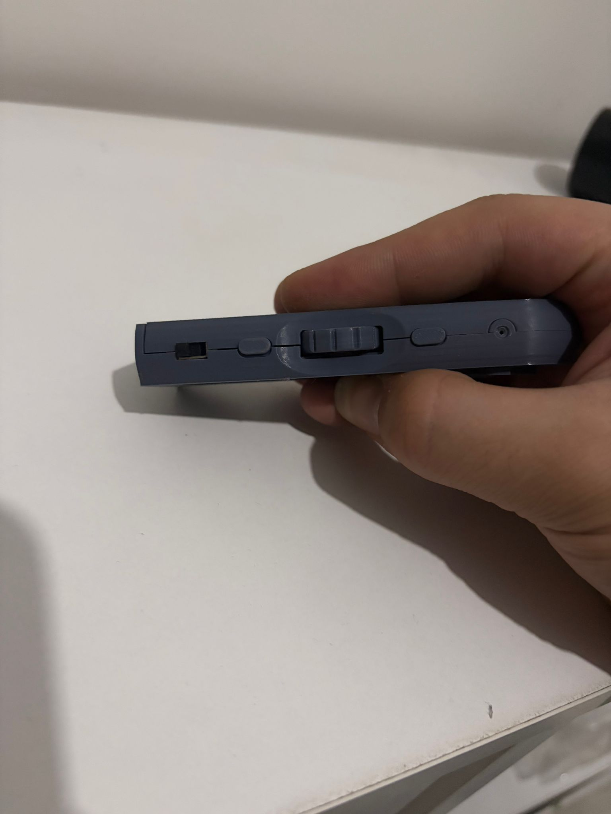
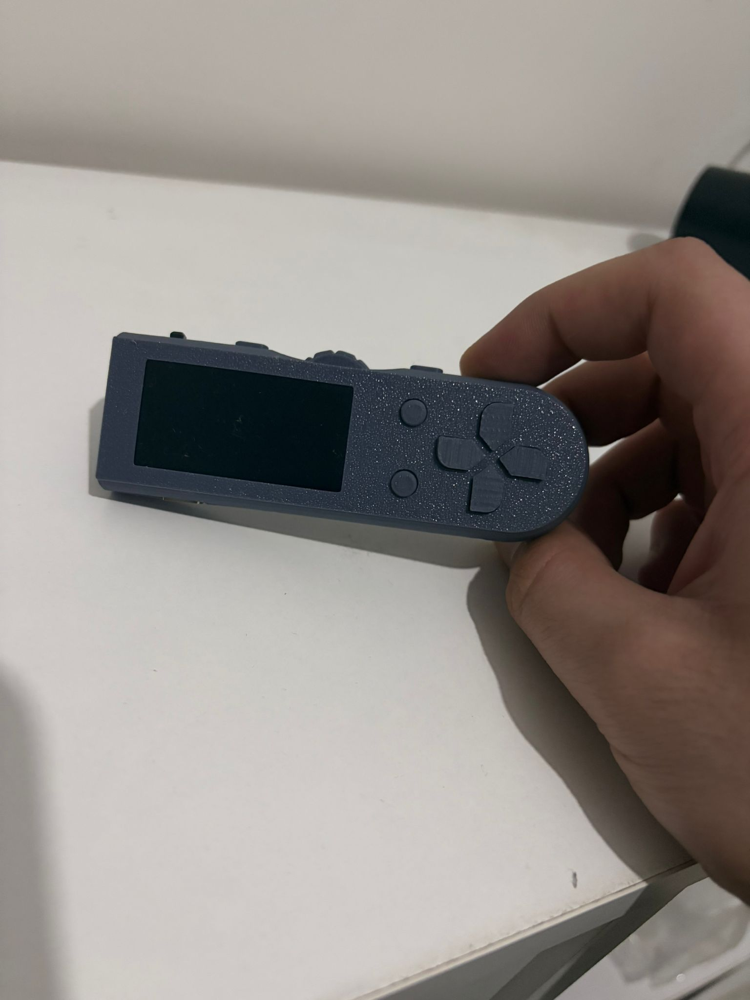
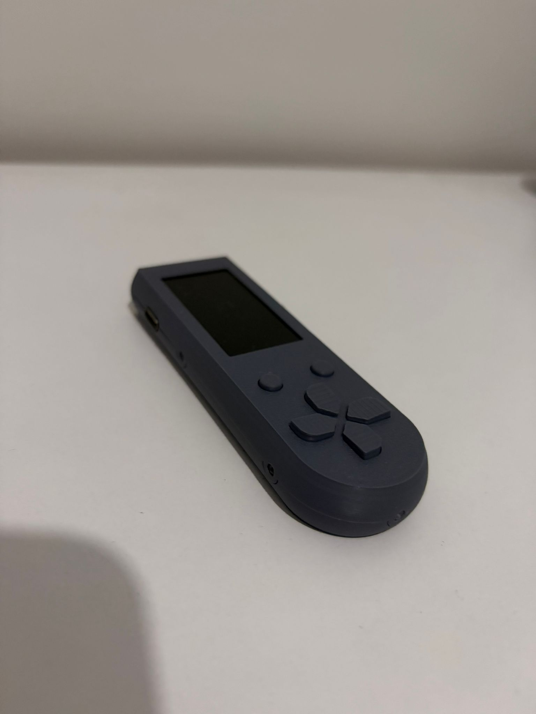
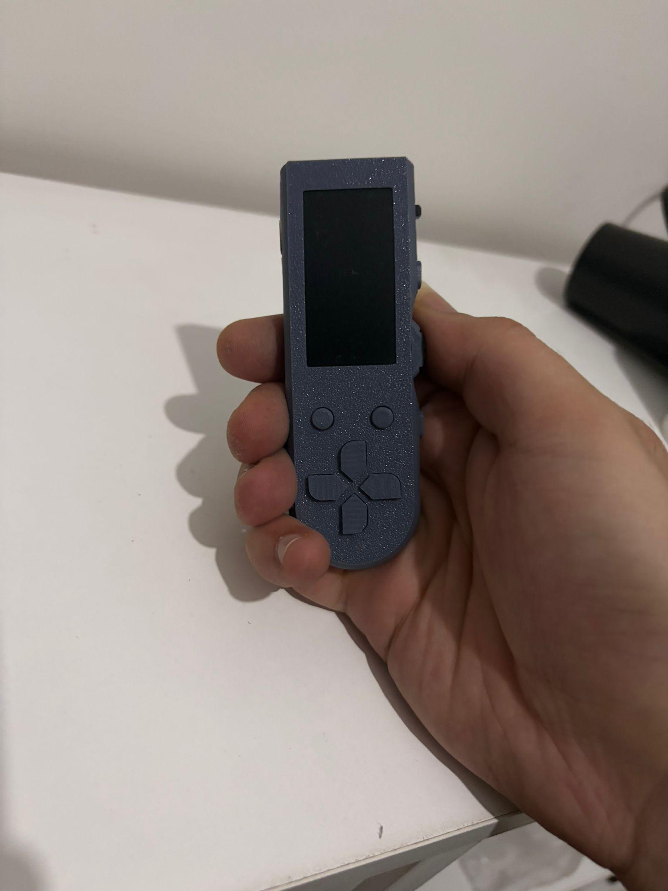
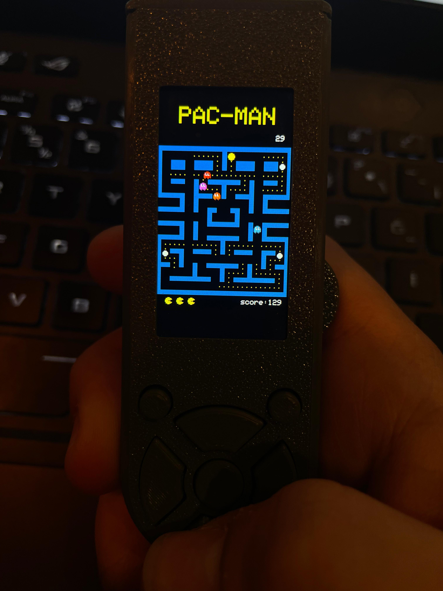
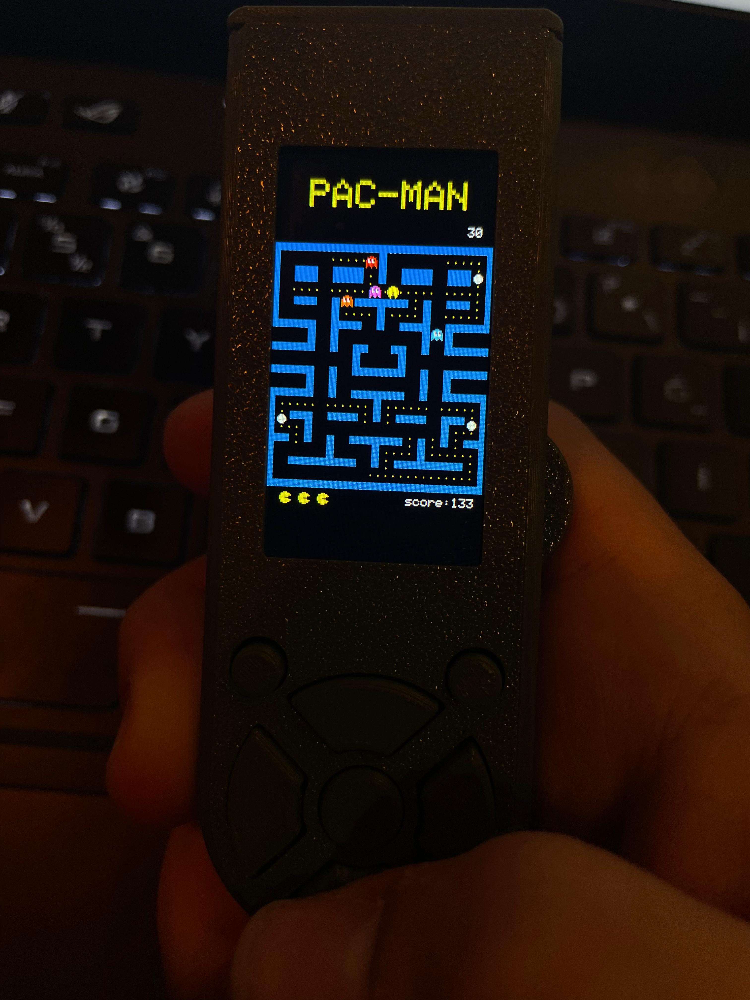

# EspCon — ESP32 Retro Game Console

## About the Project

This project brings a portable gaming experience powered by the **ESP32-S3** microcontroller. The console is built with custom hardware and software solutions designed to run retro-style games. It merges modern technology with nostalgic gaming into a low-cost, compact, and portable device.

## Features

An open-source platform for casual and retro games powered by the ESP32-S3. The goal is to create a device that offers a fast, short, and enjoyable gaming experience — perfect for one-handed use. Ideal for playing during commutes, while waiting in line, or sipping coffee.

The device includes:
- **1.9-inch TFT screen**
- **4-directional buttons**
- **3 function buttons**
- **Rotary scroll encoder** — acts as a trigger when held sideways, used for menu navigation and in-game mechanics (e.g. aiming in ColorCode)

This platform focuses on re-creations of retro games built **without any game engine** — just C++ and a graphics library (TFT_eSPI). In the future, I plan to create a lightweight game engine where scene management can be done with simple code, reusing the mechanics collected from these games.

> If you're interested in contributing or collaborating, feel free to reach out!

---

## Device Photos

  
  

  
  

---

## Setup

### Required Software

- **Arduino IDE** — recommended for programming the ESP32
- **ESP32 Board Support** — follow the [ESP32 Arduino Setup Guide](https://github.com/espressif/arduino-esp32)
- **TFT_eSPI Library** — graphics library (driver files included in `/drivers`)

### Connection and Upload

I will share the circuit diagram after finalizing the optimal hardware layout. Currently using the **LilyGO T-Display S3**. I am testing different combinations of boards, screens, and chips. Once resolved, I'll share the final version along with a **3D-printable STL shell**.

For now, check the pin definitions in `games/GameHub/pins.h` for the correct wiring. Stay tuned! 🚀

---

## GameHub System

All games are unified under a single **GameHub** sketch (`games/GameHub/GameHub.ino`). The hub provides a central menu, game switching, and shared hardware access. Each game lives in its own header file (`game_zelda.h`, `game_pacman.h`, etc.) inside a C++ namespace.

---

## Game List

| **Game**        | **Status**              | **Description**                                      |
|-----------------|-------------------------|------------------------------------------------------|
| 🟡 Pac-Man      | In Progress (85%)       | Classic maze game, reverse engineered from scratch.  |
| 🟩 Zelda        | In Progress (70%)       | Open-world adventure with sprites, enemies, and map. |
| 🎨 ColorCode    | In Progress (60%)       | Minecraft-inspired 2D color-match game port.         |
| 🎱 8-Pool       | Collision Complete      | 8-ball billiards with convex collision physics.      |
| 🐦 Flappy Ball  | Completed               | Simple Flappy Bird clone.                            |
| 🐍 Snake        | Completed               | The timeless snake game.                             |
| 🧱 Tetris       | Completed               | Classic block-stacking puzzle game.                  |
| 💣 Minesweeper  | Completed               | Classic grid-based mine-finding game.                |
| 🎳 Pinball      | In Progress             | Pinball simulation.                                  |
| 🌌 Space Inv.   | Planned                 | Retro space shooter, under development.              |
| 🍎 FruitMerge   | Needs Optimization      | Merge fruits to score points.                        |

---

## Screenshots & GIFs

### Pac-Man

  
  

### ColorCode

### Flappy Ball

### 8-Pool

---

## Contributing

1. **Fork** the repository
2. Create a new **branch**
3. Make your changes and **commit** them
4. **Submit a pull request**

---

## Contact

For questions or feedback: [furkanYildirir00@gmail.com](mailto:furkanYildirir00@gmail.com)

---

*Built with ❤️ on ESP32-S3 — no game engine, just C++*
